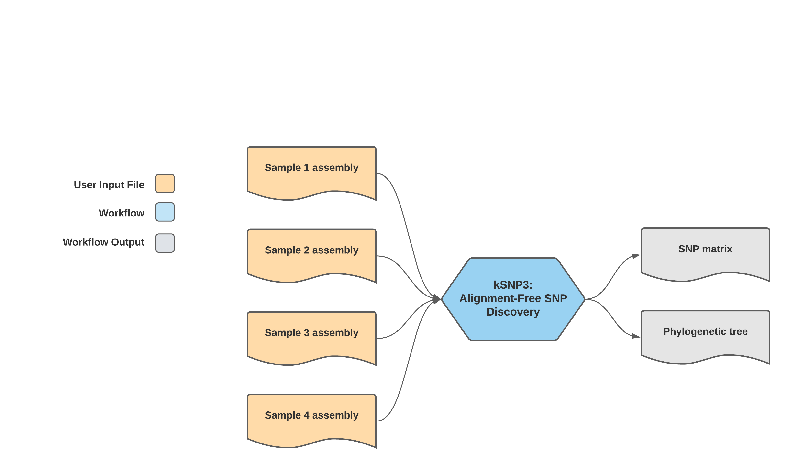
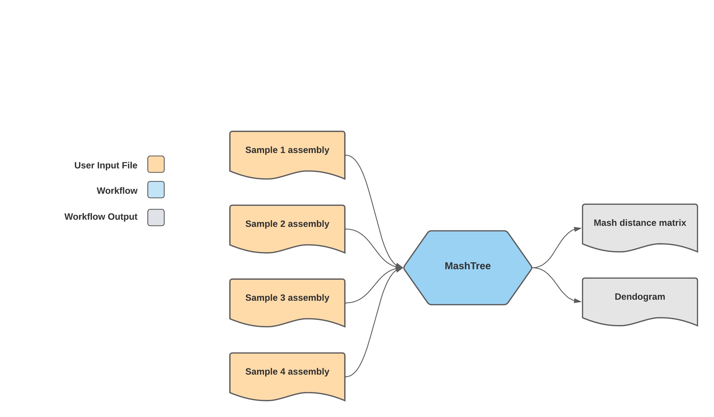

===========
Additional Workflows
===========

In addition to genomic characterization through the TheiaProk workflow series, the Public Health Bacterial Genomics repository hosts several additional workflows for genomic epidemiology and characterization of bacterial whole genome sequencing data.

Workflows for genomic epidemiology:
* kSNP3
* MashTree_FASTA

Workflows for analysis of mixed samples:
* Kraken2_PE
* Kraken2_SE

kSNP3
================================

**Input:** The `kSNP3 workflow <https://github.com/theiagen/public_health_bacterial_genomics/blob/kgl-docs-dev/workflows/wf_ksnp3.wdl>`_ takes in bacterial genome assemblies, including those produced by the TheiaProk genomic characterization workflows.

**Alignment-free SNP Discovery:** As outlined in the schematic above, the kSNP3 workflow performs alignment-free SNP discovery using kSNP3 (https://sourceforge.net/projects/ksnp).The workflow returns to the user a phylogenetic tree and SNP distance matrix (https://github.com/tseemann/snp-dists). kSNP3 will produce phylogenetic trees and SNP distance matrices for both core and pangenome analyses of the sample set. 

More information about the kSNP3 workflow including inputs, outputs and default tool parameters can be found in the tables of `required user inputs <https://github.com/theiagen/public_health_bacterial_genomics/blob/main/docs/source/tables/ksnp3_required_inputs.tsv>`_, `optional user inputs <https://github.com/theiagen/public_health_bacterial_genomics/blob/main/docs/source/tables/ksnp3_optional_inputs.tsv>`_ and `outputs <https://github.com/theiagen/public_health_bacterial_genomics/blob/main/docs/source/tables/ksnp3_outputs.tsv>`_.

.. toggle-header::
    :header: **References**

        When publishing work using the kSNP3 workflow, please reference the following:
      
        **kSNP3** Gardner, Shea N, Tom Slezak, and Barry G. Hall. “KSNP3.0: SNP Detection and Phylogenetic Analysis of Genomes without Genome Alignment or Reference Genome.” Bioinformatics 31, no. 17 (September 1, 2015): 2877–78. https://doi.org/10.1093/bioinformatics/btv271.
|

MashTree_FASTA
================================

**Input:** The `MashTree_FASTA workflow <https://github.com/theiagen/public_health_bacterial_genomics/blob/kgl-docs-dev/workflows/wf_mashtree_fasta.wdl>`_ takes in bacterial genome assemblies, including those produced by the TheiaProk genomic characterization workflows.

**MashTree:** As outlined in the schematic above, the MashTree_FASTA workflow computes genetic distances among samples in a sample set using MashTree (https://github.com/lskatz/mashtree).

More information about the MashTree_FASTA workflow including inputs, outputs and default tool parameters can be found in the tables of `required user inputs <https://github.com/theiagen/public_health_bacterial_genomics/blob/main/docs/source/tables/mashtree_fasta_required_inputs.tsv>`_, `optional user inputs <https://github.com/theiagen/public_health_bacterial_genomics/blob/main/docs/source/tables/mashtree_fasta_optional_inputs.tsv>`_ and `outputs <https://github.com/theiagen/public_health_bacterial_genomics/blob/main/docs/source/tables/mashtree_fasta_outputs.tsv>`_.

.. toggle-header::
    :header: **References**

        When publishing work using the MashTree workflow, please reference the following:
      
        Katz, Lee S., Taylor Griswold, Shatavia S. Morrison, Jason A. Caravas, Shaokang Zhang, Henk C. den Bakker, Xiangyu Deng, and Heather A. Carleton. “Mashtree: A Rapid Comparison of Whole Genome Sequence Files.” Journal of Open Source Software 4, no. 44 (December 10, 2019): 1762. https://doi.org/10.21105/joss.01762.
|

Kraken2_PE
================================

**Input:** The `Kraken2_PE workflow <https://github.com/theiagen/public_health_bacterial_genomics/blob/kgl-docs-dev/workflows/wf_kraken2_pe.wdl>`_ takes in paired-end Illumina read data. 

**Kraken2_PE:** Kraken2_PE performs taxonomic assignment of whole genome sequencing reads using a k-mer-based approach.

More information about the Kraken2_PE workflow including inputs, outputs and default tool parameters can be found in the tables of `required user inputs <https://github.com/theiagen/public_health_bacterial_genomics/blob/main/docs/source/tables/kraken2_pe_required_inputs.tsv>`_, `optional user inputs <https://github.com/theiagen/public_health_bacterial_genomics/blob/main/docs/source/tables/kraken2_pe_optional_inputs.tsv>`_  and `outputs <https://github.com/theiagen/public_health_bacterial_genomics/blob/main/docs/source/tables/kraken2_pe_outputs.tsv>`_.

.. toggle-header::
    :header: **References**

        When publishing work using the MashTree workflow, please reference the following:
      
        Katz, Lee S., Taylor Griswold, Shatavia S. Morrison, Jason A. Caravas, Shaokang Zhang, Henk C. den Bakker, Xiangyu Deng, and Heather A. Carleton. “Mashtree: A Rapid Comparison of Whole Genome Sequence Files.” Journal of Open Source Software 4, no. 44 (December 10, 2019): 1762. https://doi.org/10.21105/joss.01762.
|